# 全体のフロー
## Engineクラスのクラス図
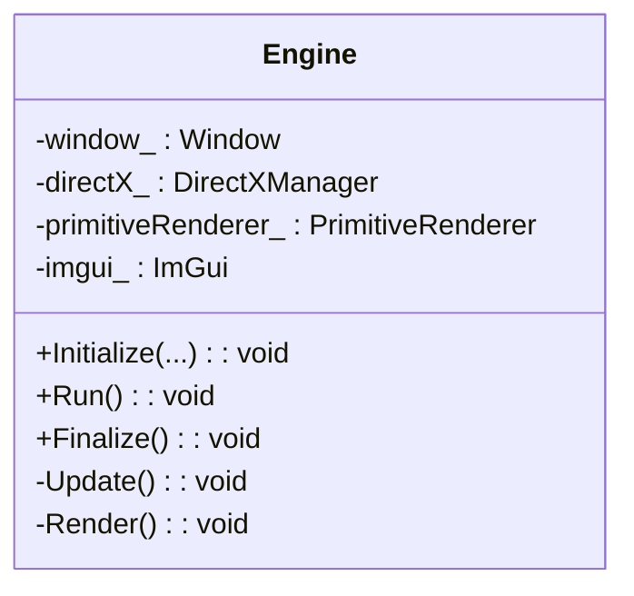
```mermaid
classDiagram
class Engine {
    -window_ : Window 
    -directX_ : DirectXManager
    -primitiveRenderer_ : PrimitiveRenderer
    -imgui_ : ImGui
    +Initialize(...) : void
    +Run() : void
    +Finalize() : void
    -Update() : void
    -Render() : void
}

```
## Engineクラスのフロー
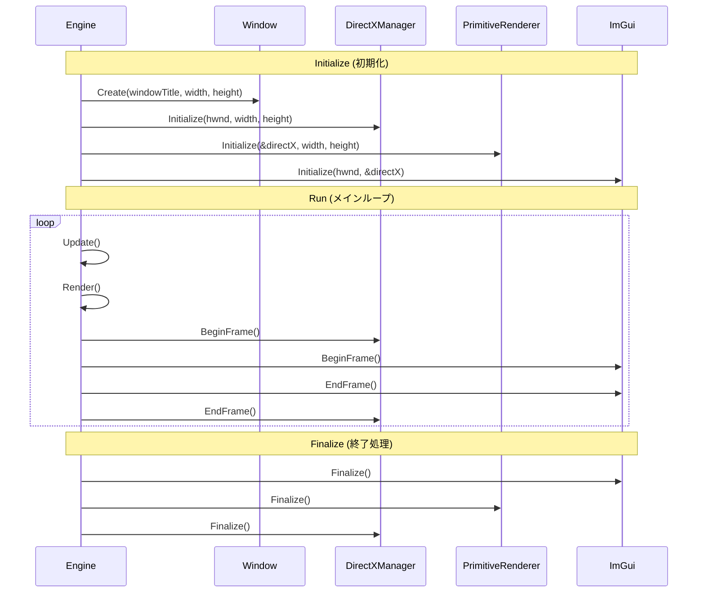
```mermaid
sequenceDiagram
    participant E as Engine
    participant W as Window
    participant D as DirectXManager
    participant PR as PrimitiveRenderer
    participant I as ImGui
    
    Note over E, I: Initialize (初期化)
    E->>W: Create(windowTitle, width, height)
    E->>D: Initialize(hwnd, width, height)
    E->>PR: Initialize(&directX, width, height)
    E->>I: Initialize(hwnd, &directX)
    
    Note over E, I: Run (メインループ)
    loop 
        E->>E: Update()
        
        %% Renderメソッドの中身を展開して記述
        E->>E: Render()
        E->>D: BeginFrame()
        E->>I: BeginFrame()
        E->>I: EndFrame()
        E->>D: EndFrame()
  end

    Note over E, I: Finalize (終了処理)
    E->>I: Finalize()
    E->>PR: Finalize()
    E->>D: Finalize()
    

```
## Windowクラス
### Windowクラスのクラス図
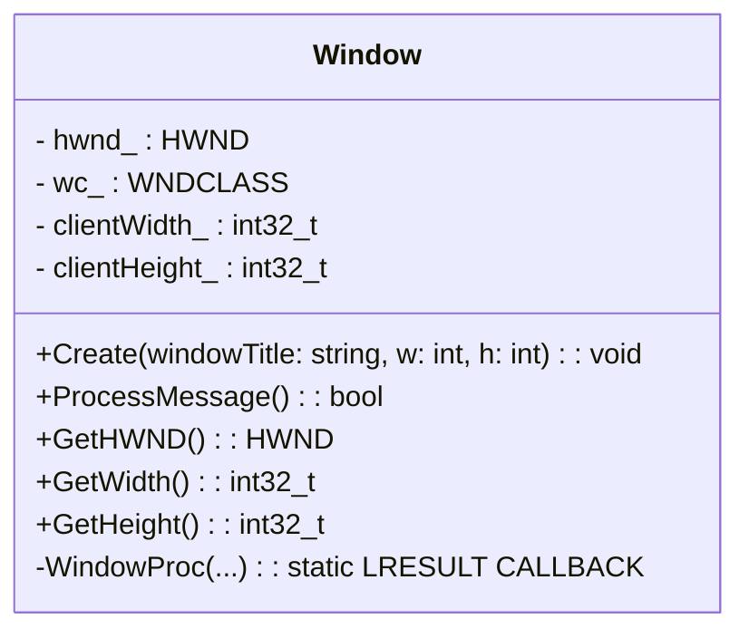
```mermaid
classDiagram
    class Window {
        - hwnd_ : HWND
        - wc_ : WNDCLASS
        - clientWidth_ : int32_t
        - clientHeight_ : int32_t
        +Create(windowTitle: string, w: int, h: int) : void
        +ProcessMessage() : bool
        +GetHWND() : HWND
        +GetWidth() : int32_t
        +GetHeight() : int32_t
        -WindowProc(...) : static LRESULT CALLBACK 
    }

```
### WindowクラスのCreateメソッドのフロー
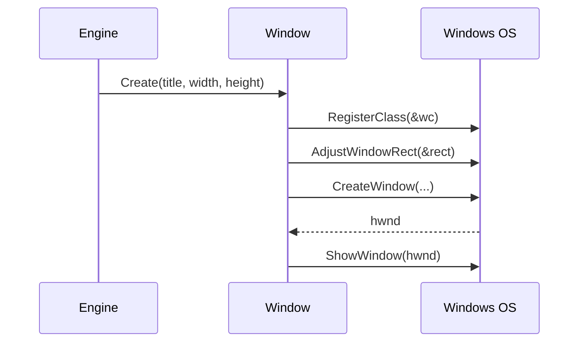
``` mermaid
sequenceDiagram
    participant E as Engine
    participant W as Window
    participant OS as Windows OS

    E->>W: Create(title, width, height)
    W->>OS: RegisterClass(&wc)
    W->>OS: AdjustWindowRect(&rect)
    W->>OS: CreateWindow(...)
    OS-->>W: hwnd
    W->>OS: ShowWindow(hwnd)

```
### WindowクラスのProcessMessageメソッドのフロー
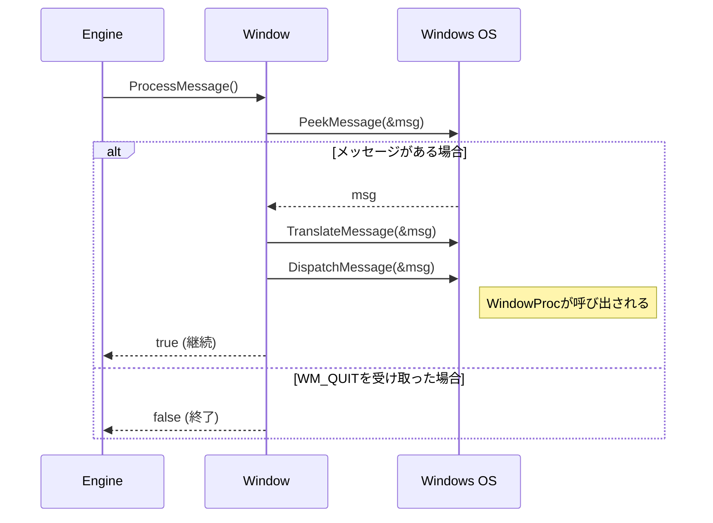
```mermaid
sequenceDiagram
    participant E as Engine
    participant W as Window
    participant OS as Windows OS

    E->>W: ProcessMessage()
    W->>OS: PeekMessage(&msg)
    alt メッセージがある場合
        OS-->>W: msg
        W->>OS: TranslateMessage(&msg)
        W->>OS: DispatchMessage(&msg)
        Note right of OS: WindowProcが呼び出される
        W-->>E: true (継続)
    else WM_QUITを受け取った場合
        W-->>E: false (終了)
    end
```
### WindowクラスのWindowProcメソッドのフロー
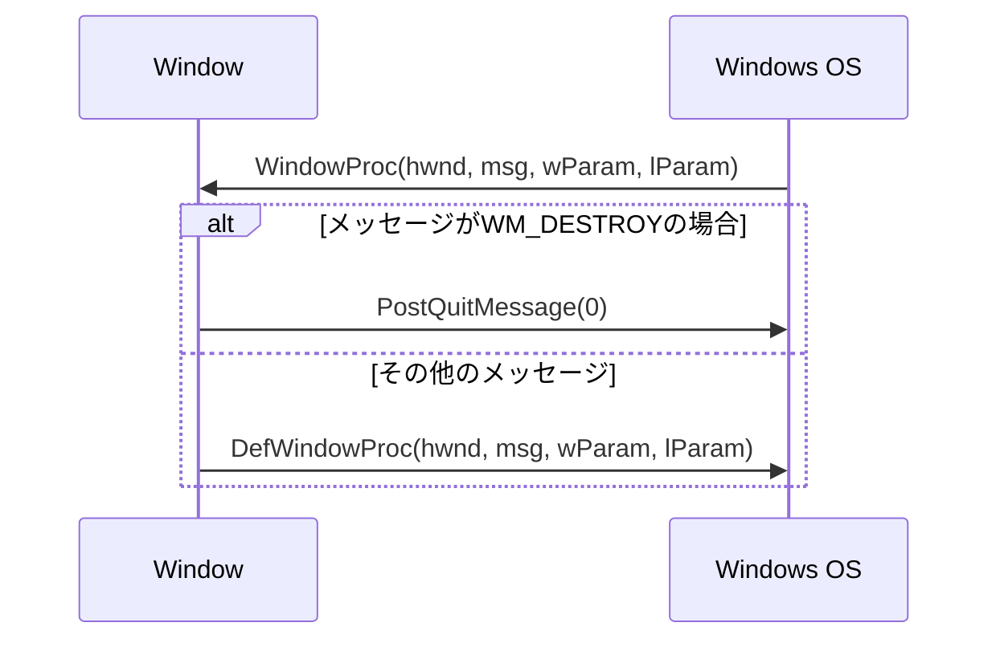
```mermaid
sequenceDiagram
    participant W as Window
    participant OS as Windows OS
    OS->>W: WindowProc(hwnd, msg, wParam, lParam)
    alt メッセージがWM_DESTROYの場合
        W->>OS: PostQuitMessage(0)
    else その他のメッセージ
        W->>OS: DefWindowProc(hwnd, msg, wParam, lParam)
    end
```
### Windowクラスの解説
Windowクラスは、Windows OSのウィンドウを管理するクラスです。
複雑なWindowsAPIの呼び出しをラップして､ウィンドウの作成やメッセージ処理を簡単に行えるようにしています。

## DirectXManagerクラス
### DirectXManagerクラスのクラス図
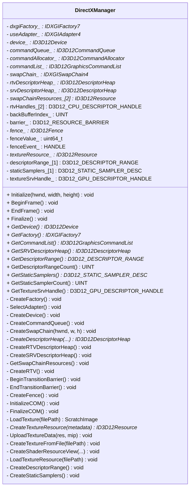
```mermaid
classDiagram
    class DirectXManager {
        %% メンバ変数（private）
        - dxgiFactory_ : IDXGIFactory7*
        - useAdapter_ : IDXGIAdapter4*
        - device_ : ID3D12Device*
        - commandQueue_ : ID3D12CommandQueue*
        - commandAllocator_ : ID3D12CommandAllocator*
        - commandList_ : ID3D12GraphicsCommandList*
        - swapChain_ : IDXGISwapChain4*
        - rtvDescriptorHeap_ : ID3D12DescriptorHeap*
        - srvDescriptorHeap_ : ID3D12DescriptorHeap*
        - swapChainResources_[2] : ID3D12Resource*
        - rtvHandles_[2] : D3D12_CPU_DESCRIPTOR_HANDLE
        - backBufferIndex_ : UINT
        - barrier_ : D3D12_RESOURCE_BARRIER
        - fence_ : ID3D12Fence*
        - fenceValue_ : uint64_t
        - fenceEvent_ : HANDLE
        - textureResource_ : ID3D12Resource*
        - descriptorRange_[1] : D3D12_DESCRIPTOR_RANGE
        - staticSamplers_[1] : D3D12_STATIC_SAMPLER_DESC
        - textureSrvHandle_ : D3D12_GPU_DESCRIPTOR_HANDLE

        %% 公開関数（public）
        + Initialize(hwnd, width, height) void
        + BeginFrame() void
        + EndFrame() void
        + Finalize() void
        + GetDevice() ID3D12Device*
        + GetFactory() IDXGIFactory7*
        + GetCommandList() ID3D12GraphicsCommandList*
        + GetSRVDescriptorHeap() ID3D12DescriptorHeap*
        + GetDescriptorRange() D3D12_DESCRIPTOR_RANGE*
        + GetDescriptorRangeCount() UINT
        + GetStaticSamplers() D3D12_STATIC_SAMPLER_DESC*
        + GetStaticSamplerCount() UINT
        + GetTextureSrvHandle() D3D12_GPU_DESCRIPTOR_HANDLE

        %% 内部関数（private）
        - CreateFactory() void
        - SelectAdapter() void
        - CreateDevice() void
        - CreateCommandQueue() void
        - CreateSwapChain(hwnd, w, h) void
        - CreateDescriptorHeap(...) ID3D12DescriptorHeap*
        - CreateRTVDescriptorHeap() void
        - CreateSRVDescriptorHeap() void
        - GetSwapChainResources() void
        - CreateRTV() void
        - BeginTransitionBarrier() void
        - EndTransitionBarrier() void
        - CreateFence() void
        - InitializeCOM() void
        - FinalizeCOM() void
        - LoadTexture(filePath) ScratchImage
        - CreateTextureResource(metadata) ID3D12Resource*
        - UploadTextureData(res, mip) void
        - CreateTextureFromFile(filePath) void
        - CreateShaderResourceView(...) void
        - LoadTextureResource(filePath) void
        - CreateDescriptorRange() void
        - CreateStaticSamplers() void
    }
```
### DirectXManagerクラスのInitializeメソッドのフロー
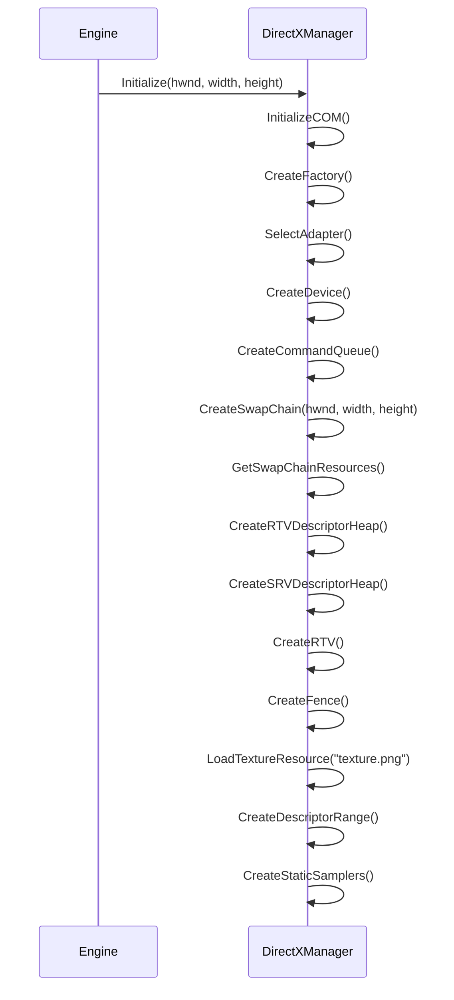
```mermaid
sequenceDiagram
    participant E as Engine
    participant D as DirectXManager
    E->>D: Initialize(hwnd, width, height)
    D->>D: InitializeCOM()
    D->>D: CreateFactory()
    D->>D: SelectAdapter()
    D->>D: CreateDevice()
    D->>D: CreateCommandQueue()
    D->>D: CreateSwapChain(hwnd, width, height)
    D->>D: GetSwapChainResources()
    D->>D: CreateRTVDescriptorHeap()
    D->>D: CreateSRVDescriptorHeap()
    D->>D: CreateRTV()
    D->>D: CreateFence()
    D->>D: LoadTextureResource("texture.png")
    D->>D: CreateDescriptorRange()
    D->>D: CreateStaticSamplers()
```
### DirectXManagerクラスのBeginFrameのフロー
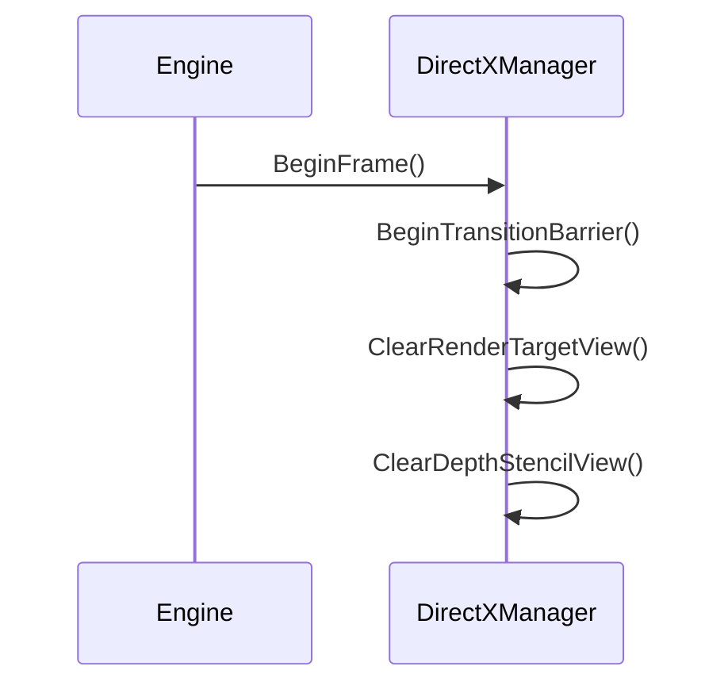
```mermaid
sequenceDiagram
    participant E as Engine
    participant D as DirectXManager
    E->>D: BeginFrame()
    D->>D: BeginTransitionBarrier()
    D->>D: ClearRenderTargetView()
    D->>D: ClearDepthStencilView()
```
### DirectXManagerクラスのEndFrameのフロー
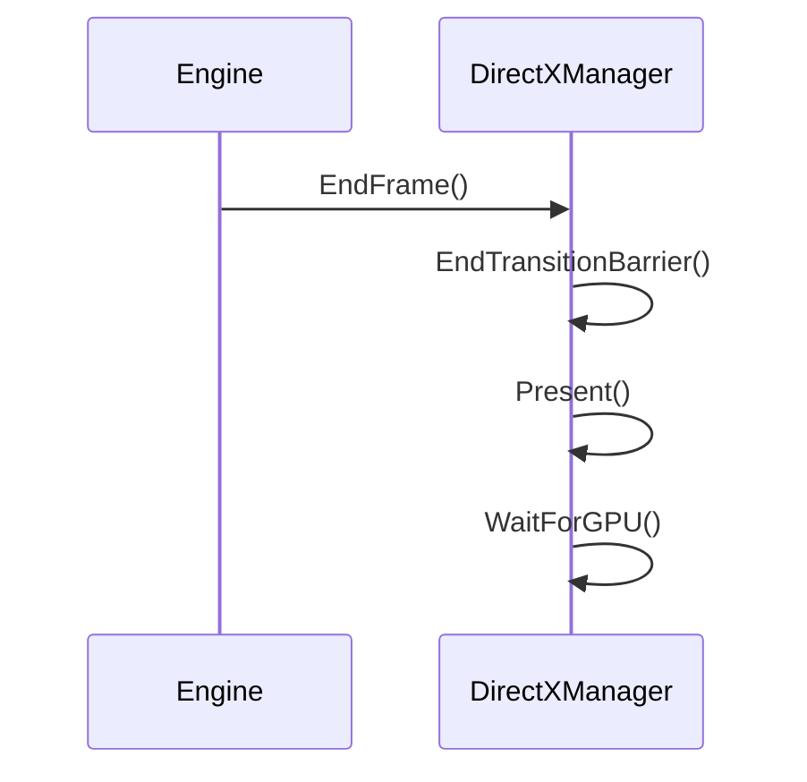
```mermaid
sequenceDiagram
    participant E as Engine
    participant D as DirectXManager
    E->>D: EndFrame()
    D->>D: EndTransitionBarrier()
    D->>D: Present()
    D->>D: WaitForGPU()
```
### DirectXManagerクラスのFinalizeメソッドのフロー
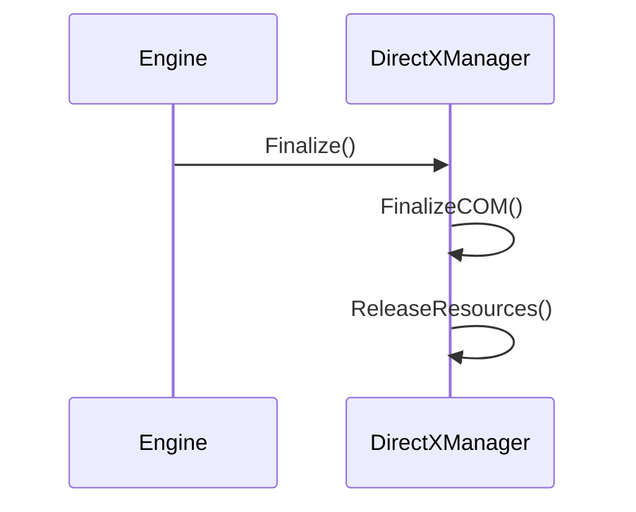
```mermaid
sequenceDiagram
    participant E as Engine
    participant D as DirectXManager
    E->>D: Finalize()
    D->>D: FinalizeCOM()
    D->>D: ReleaseResources()
```
### DirectXManagerクラスの解説
DirectXManagerクラスは、DirectX 12の初期化,レンダリングフローを担当するクラスです。

## PrimitiveRendererクラス
###PrimitiveRendererクラスのクラス図
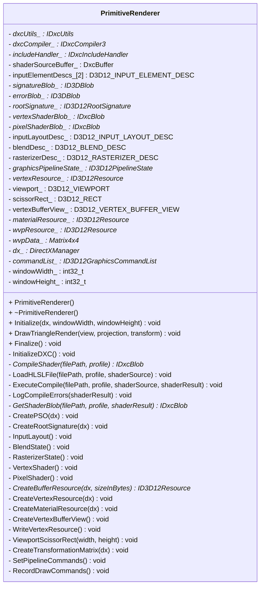
```mermaid
classDiagram
    class PrimitiveRenderer {
        %% メンバ変数（private）
        - dxcUtils_ : IDxcUtils*
        - dxcCompiler_ : IDxcCompiler3*
        - includeHandler_ : IDxcIncludeHandler*
        - shaderSourceBuffer_ : DxcBuffer
        - inputElementDescs_[2] : D3D12_INPUT_ELEMENT_DESC
        - signatureBlob_ : ID3DBlob*
        - errorBlob_ : ID3DBlob*
        - rootSignature_ : ID3D12RootSignature*
        - vertexShaderBlob_ : IDxcBlob*
        - pixelShaderBlob_ : IDxcBlob*
        - inputLayoutDesc_ : D3D12_INPUT_LAYOUT_DESC
        - blendDesc_ : D3D12_BLEND_DESC
        - rasterizerDesc_ : D3D12_RASTERIZER_DESC
        - graphicsPipelineState_ : ID3D12PipelineState*
        - vertexResource_ : ID3D12Resource*
        - viewport_ : D3D12_VIEWPORT
        - scissorRect_ : D3D12_RECT
        - vertexBufferView_ : D3D12_VERTEX_BUFFER_VIEW
        - materialResource_ : ID3D12Resource*
        - wvpResource_ : ID3D12Resource*
        - wvpData_ : Matrix4x4*
        - dx_ : DirectXManager*
        - commandList_ : ID3D12GraphicsCommandList*
        - windowWidth_ : int32_t
        - windowHeight_ : int32_t

        %% 公開関数（public）
        + PrimitiveRenderer()
        + ~PrimitiveRenderer()
        + Initialize(dx, windowWidth, windowHeight) void
        + DrawTriangleRender(view, projection, transform) void
        + Finalize() void

        %% 内部関数（private）
        - InitializeDXC() void
        - CompileShader(filePath, profile) IDxcBlob*
        - LoadHLSLFile(filePath, profile, shaderSource) void
        - ExecuteCompile(filePath, profile, shaderSource, shaderResult) void
        - LogCompileErrors(shaderResult) void
        - GetShaderBlob(filePath, profile, shaderResult) IDxcBlob*
        - CreatePSO(dx) void
        - CreateRootSignature(dx) void
        - InputLayout() void
        - BlendState() void
        - RasterizerState() void
        - VertexShader() void
        - PixelShader() void
        - CreateBufferResource(dx, sizeInBytes) ID3D12Resource*
        - CreateVertexResource(dx) void
        - CreateMaterialResource(dx) void
        - CreateVertexBufferView() void
        - WriteVertexResource() void
        - ViewportScissorRect(width, height) void
        - CreateTransformationMatrix(dx) void
        - SetPipelineCommands() void
        - RecordDrawCommands() void
    }

```
### PrimitiveRendererクラスのInitializeメソッドのフロー
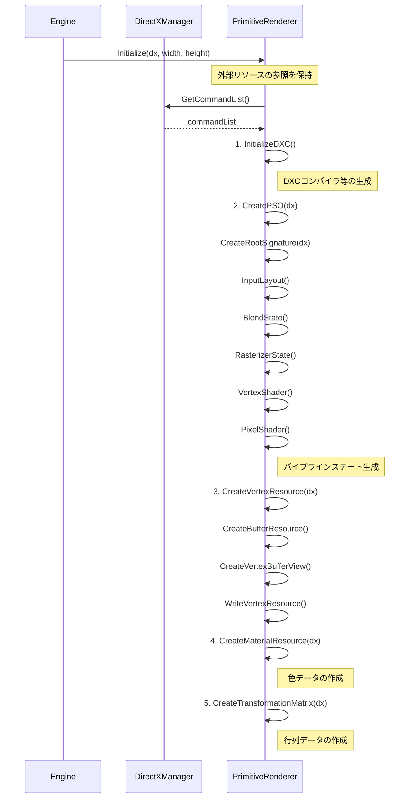
```mermaid
  sequenceDiagram
    participant E as Engine
    participant dx as DirectXManager
    participant P as PrimitiveRenderer

    E->>P: Initialize(dx, width, height)
    
    Note over P: 外部リソースの参照を保持
    P->>dx: GetCommandList()
    dx-->>P: commandList_
    
    P->>P: 1. InitializeDXC()
    Note right of P: DXCコンパイラ等の生成
    
    P->>P: 2. CreatePSO(dx)
    P->>P: CreateRootSignature(dx)
    P->>P: InputLayout()
    P->>P: BlendState()
    P->>P: RasterizerState()
    P->>P: VertexShader()
    P->>P: PixelShader()
    Note right of P: パイプラインステート生成
    
    P->>P: 3. CreateVertexResource(dx)
    P->>P: CreateBufferResource()
    P->>P: CreateVertexBufferView()
    P->>P: WriteVertexResource()
    
    P->>P: 4. CreateMaterialResource(dx)
    Note right of P: 色データの作成
    
    P->>P: 5. CreateTransformationMatrix(dx)
    Note right of P: 行列データの作成
```
### PrimitiveRendererクラスのDrawTriangleRenderメソッドのフロー
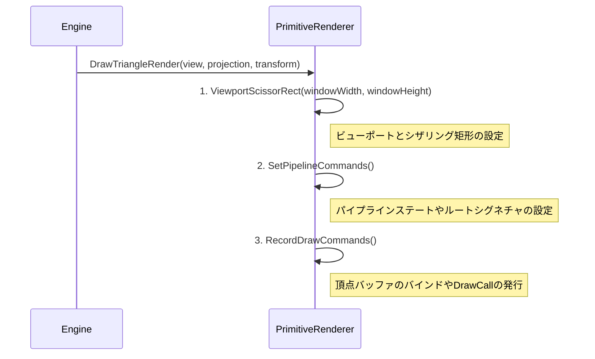
```mermaid 
sequenceDiagram
    participant E as Engine
    participant P as PrimitiveRenderer
    E->>P: DrawTriangleRender(view, projection, transform)
    
    P->>P: 1. ViewportScissorRect(windowWidth, windowHeight)
    Note right of P: ビューポートとシザリング矩形の設定
    
    P->>P: 2. SetPipelineCommands()
    Note right of P: パイプラインステートやルートシグネチャの設定
    
    P->>P: 3. RecordDrawCommands()
    Note right of P: 頂点バッファのバインドやDrawCallの発行
```

### PrimitiveRendererクラスのFinalizeメソッドのフロー
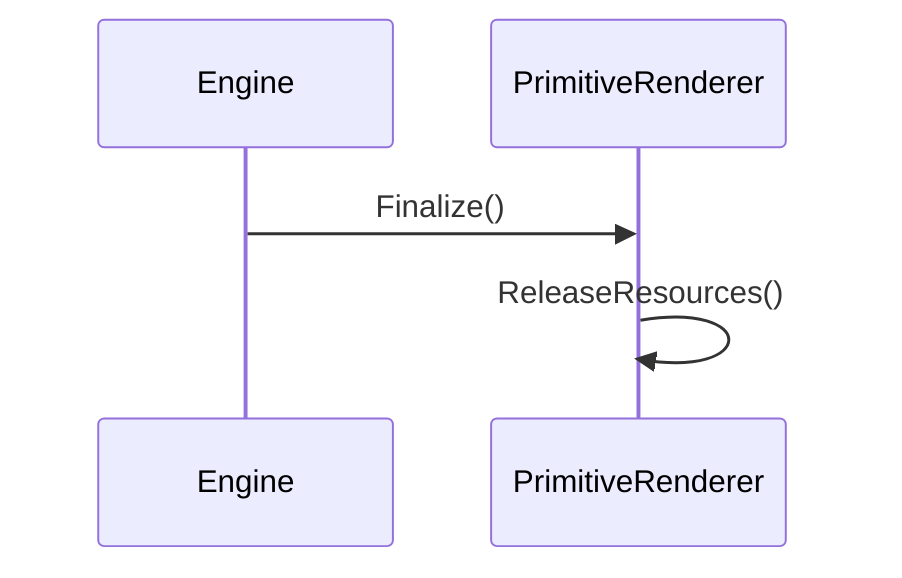
```mermaid
sequenceDiagram
    participant E as Engine
    participant P as PrimitiveRenderer
    E->>P: Finalize()
    P->>P: ReleaseResources()
```
### PrimitiveRendererクラスの解説
PrimitiveRendererクラスは､DirectX 12を使用して基本的なプリミティブ（この場合は三角形）を描画するためのクラスです。

## ImGuiManagerクラス
### ImGuiManagerクラスのクラス図
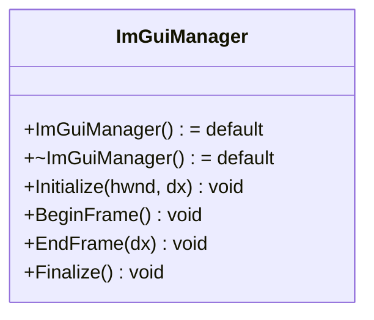
``` mermaid
classDiagram
    class ImGuiManager {
      +ImGuiManager() = default
        +~ImGuiManager() = default
        +Initialize(hwnd, dx) void
        +BeginFrame() void
        +EndFrame(dx) void
        +Finalize() void
    }
```
### ImGuiManagerクラスのInitializeメソッドのフロー
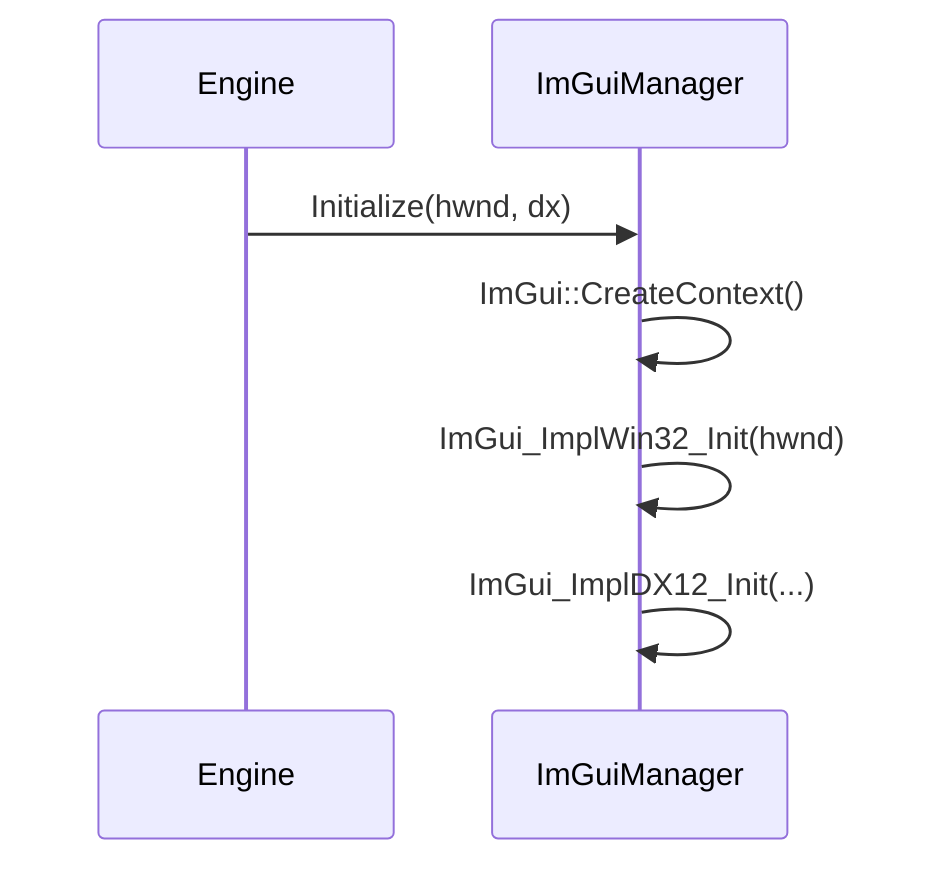
```mermaid
sequenceDiagram
    participant E as Engine
    participant I as ImGuiManager
    E->>I: Initialize(hwnd, dx)
    I->>I: ImGui::CreateContext()
    I->>I: ImGui_ImplWin32_Init(hwnd)
    I->>I: ImGui_ImplDX12_Init(...)
```
### ImGuiManagerクラスのBeginFrameメソッドのフロー
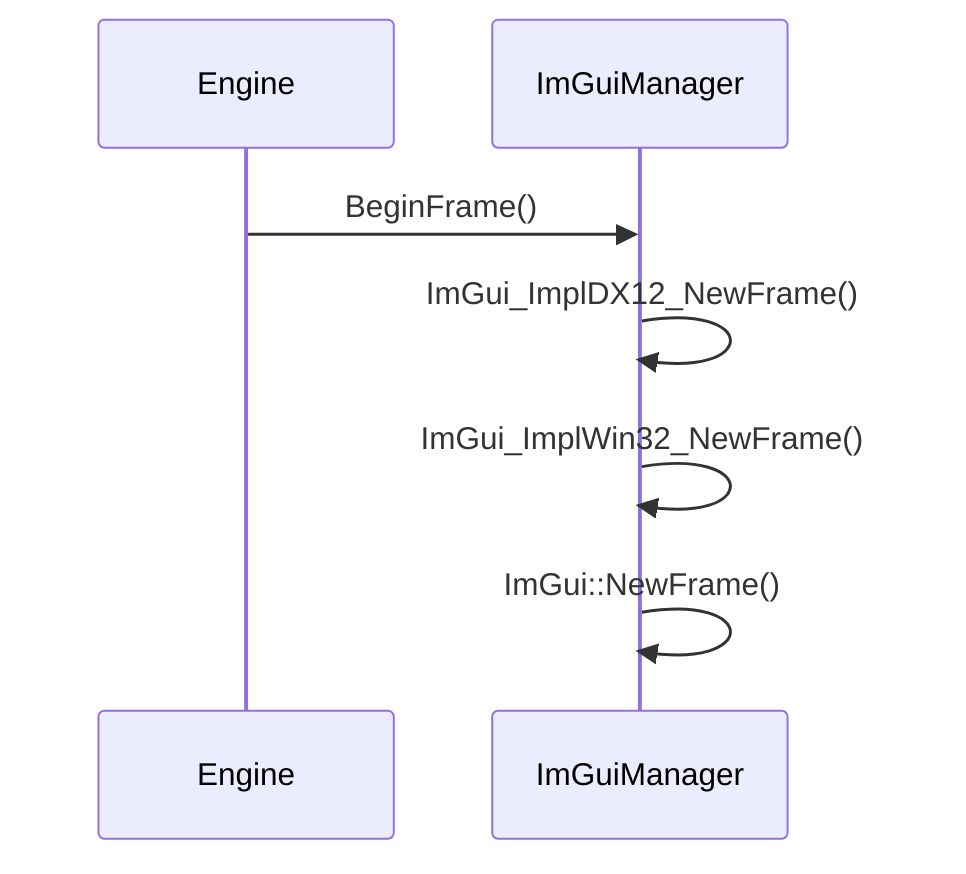
```mermaid
sequenceDiagram
    participant E as Engine
    participant I as ImGuiManager
    E->>I: BeginFrame()
    I->>I: ImGui_ImplDX12_NewFrame()
    I->>I: ImGui_ImplWin32_NewFrame()
    I->>I: ImGui::NewFrame()
```
### ImGuiManagerクラスのEndFrameメソッドのフロー
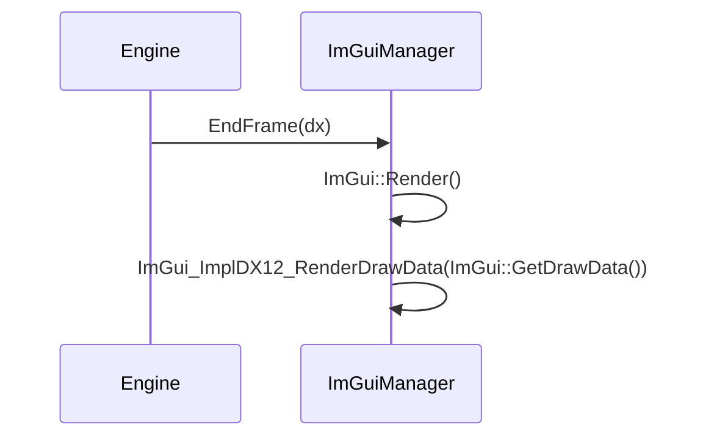
```mermaid
   sequenceDiagram
    participant E as Engine
    participant I as ImGuiManager
    E->>I: EndFrame(dx)
    I->>I: ImGui::Render()
    I->>I: ImGui_ImplDX12_RenderDrawData(ImGui::GetDrawData())
```

### ImGuiManagerクラスのFinalizeメソッドのフロー
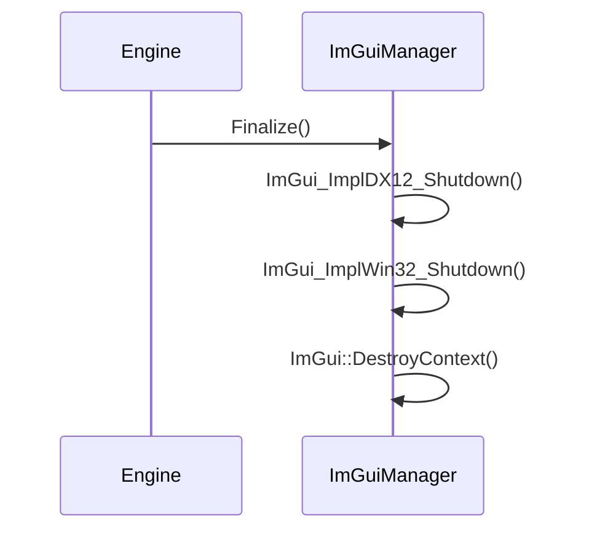
```mermaid
sequenceDiagram
    participant E as Engine
    participant I as ImGuiManager
    E->>I: Finalize()
    I->>I: ImGui_ImplDX12_Shutdown()
    I->>I: ImGui_ImplWin32_Shutdown()
    I->>I: ImGui::DestroyContext()
```

### ImGuiManagerクラスの解説
ImGuiManagerクラスは、Dear ImGuiの初期化､フレームの開始と終了､および終了処理を担当するクラスです。
