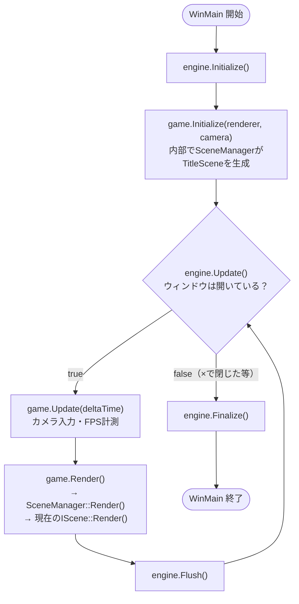
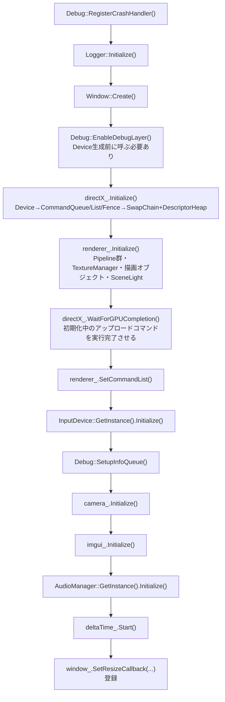
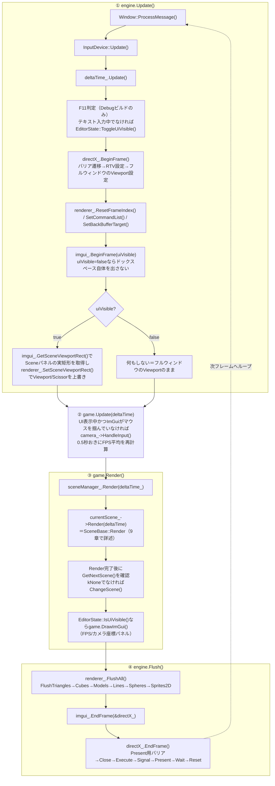
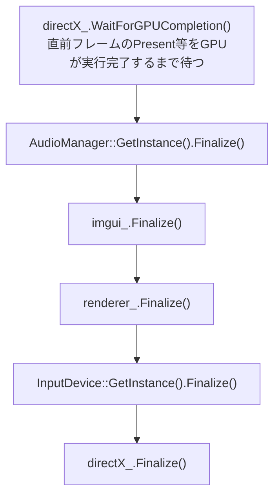
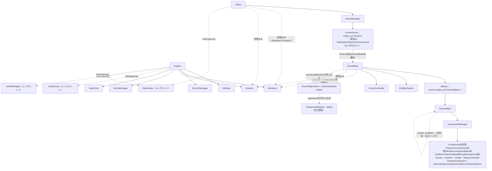
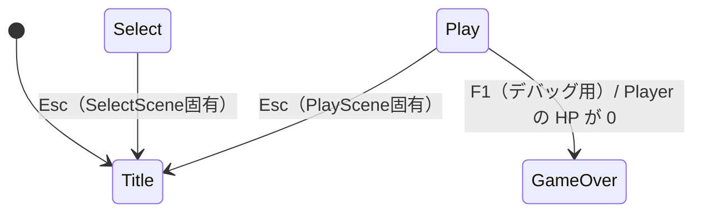
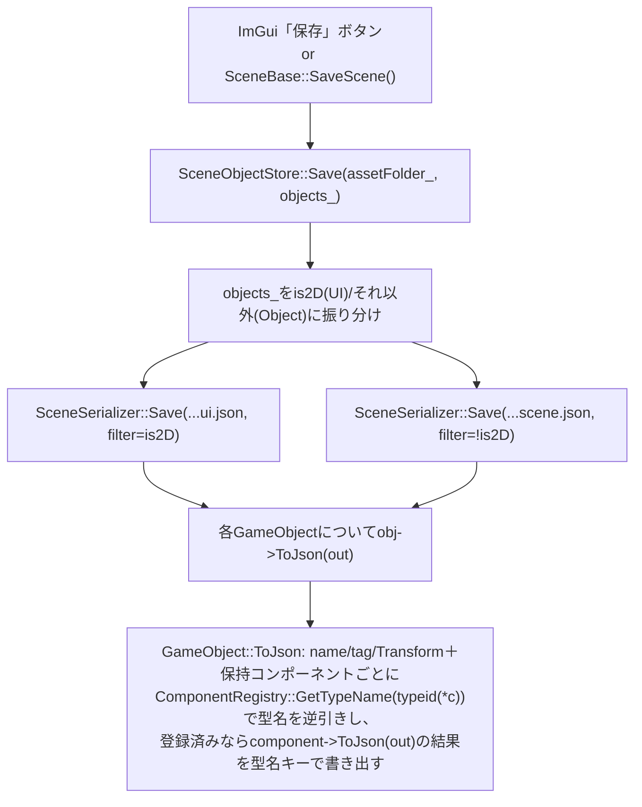
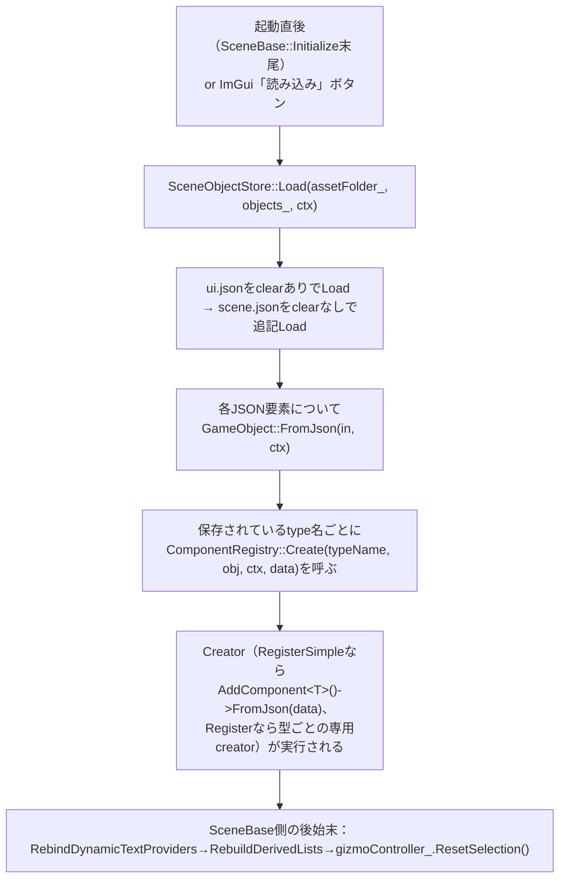
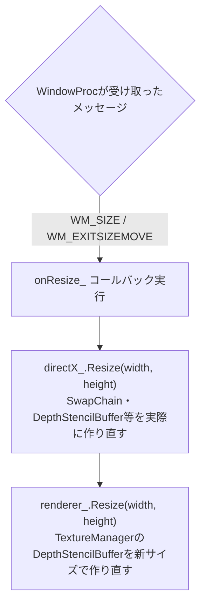

# プログラム全体の流れ図（改訂版）

ClearRoot Engine（自作DirectX12ゲームエンジン）の、起動から終了までの処理の流れをまとめたドキュメント。
[プログラム全体の流れ図.md](プログラム全体の流れ図.md)（2026-07-03作成）の内容を、Scene切り替え・GameObject親子化・
ComponentManager・エディタ機能（Hierarchy/Inspector/Projectパネル・保存/読み込み・Scene/Gameビュー切替）等、
それ以降の変更を反映して作り直したもの。「何を呼んでいるか」だけでなく「なぜその順番なのか」も可能な範囲で注記している。

> 作成基準日: 2026-07-24（このドキュメントはコードのスナップショットなので、実装が変わったら古くなる。疑わしい箇所は本文中に書いたファイル名・行番号を実際に読み直すこと）
>
> 役割分担: このドキュメントは「制御フロー（誰が誰をいつ呼ぶか）」専用。個々のコンポーネントのフィールド一覧は
> [docs/Components.md](docs/Components.md)、DirectX12の各機能を「なぜ」から学びたい場合は
> [学習用07-03.md](学習用07-03.md) を参照（どちらも本書より前の内容を含み、細部は古くなっている場合がある）。

## 目次
1. [全体像（ダイジェスト）](#1-全体像ダイジェスト)
2. [初期化フロー](#2-初期化フロー)
3. [メインループ（Update / Render / Flush）](#3-メインループupdate--render--flush)
4. [終了処理（Engine::Finalize）](#4-終了処理enginefinalize)
5. [クラス構成・所有関係](#5-クラス構成所有関係)
6. [主要クラス一覧表](#6-主要クラス一覧表)
7. [シーンの切り替え（SceneManager / IScene）](#7-シーンの切り替えscenemanager--iscene)
8. [GameObject・コンポーネントの保存と復元](#8-gameobjectコンポーネントの保存と復元)
9. [SceneBase::Render() 内の描画順序](#9-scenebaserender-内の描画順序)
10. [エディタUI表示切替（F11）とScene/Gameビュー切替の関係](#10-エディタui表示切替f11とscenegameビュー切替の関係)
11. [番外: ウィンドウリサイズ時の流れ](#11-番外-ウィンドウリサイズ時の流れ)
12. [命名パターンのまとめ](#12-命名パターンのまとめ)

---

## 1. 全体像（ダイジェスト）

エントリーポイントは `main.cpp:8` の `WinMain`。`Engine` と `Game` という2つのクラスを生成し、
「初期化 → ループ（更新・描画・GPU実行）→ 終了処理」という形は旧版から変わっていない。
変わったのは `Game` の中身で、以前は `Game` 自身がCube/Sphere等のデモオブジェクトを直接持っていたが、
現在は `Game` は薄い器になり、実際のシーン内容（Title/Select/Play/GameOver）は `SceneManager` が管理する
`IScene` 派生クラスに委譲されている。


出典: `main.cpp:8-25`

`Engine`（エンジン層。ゲームの中身を一切知らない）と `Game`（アプリケーション層）の境界は旧版と同じだが、
`Game` の内部がさらに1段掘り下げられた形になっている。

```
┌─ Engine（変更なし） ─────────────────────────────────────────┐
│ Window / DirectXManager / Renderer / Camera / ImGui / Input / Audio │
└──────────────────────────────────────────────────────────────┘
                 ↑ GetRenderer() / GetCamera() で「貸し出す」だけ
┌─ Game（薄い器：FPS計測とSceneManagerへの委譲のみ） ─────────────┐
│  SceneManager                                                  │
│   └─ IScene（現在1つだけ生成・所有。差し替え可能）              │
│       └─ SceneBase（Title/Select/Play/GameOver共通の中身）      │
│           └─ GameObject群（Cube/Player/HUD/ライト等）           │
└──────────────────────────────────────────────────────────────┘
```

### なぜ `Game` からデモの中身を抜いたのか
旧版の `Game` は「エンジンで作る具体的なゲーム」の全部（オブジェクト配置・当たり判定・Gizmo・約400行のImGuiパネル）を
1クラスに抱えていた。タイトル画面・ゲームオーバー画面等、性質の異なる複数の「画面」が必要になった時点で
1クラスのままでは肥大化する一方のため、「画面ごとに異なる部分」（`IScene`）と「画面をまたいで共通の器」（`Game`）を分離した。
`Game` に残っているのは、どの画面でも共通に必要な処理（Renderer/Cameraの橋渡し、FPS計測）だけ（`Game/Game.h:6-8`）。

---

## 2. 初期化フロー

### 2-1. Engine::Initialize（変更なし）
DirectX12はDevice→CommandQueue→SwapChainの順でしか作れないため、この順序は厳密に守る必要がある。
旧版から実装は変わっていない。


出典: `Engine/Engine.cpp:7-27`

### 2-2. Game::Initialize → SceneManager → IScene::Initialize
`main.cpp:14` から呼ばれる `game.Initialize(engine.GetRenderer(), engine.GetCamera())` の中身。

```mermaid
flowchart TD
    A["RegisterEngineComponents()<br/>JSON保存/復元のためコンポーネント型を1回だけ登録"] --> B["sceneManager_.Initialize(renderer, camera, SceneType::kTitle)"]
    B --> C["SceneManager::ChangeScene(kTitle)"]
    C --> D["CreateScene(kTitle) → std::make_unique&lt;TitleScene&gt;()"]
    D --> E["currentScene_->Initialize(renderer, camera, \"Title\")<br/>＝SceneBase::Initialize"]

    subgraph SceneInit["SceneBase::Initialize"]
        E --> F["共有テクスチャ一覧をロード<br/>t.png/f.png/s.png/monsterBall.png.png/White.png/transparent.png"]
        F --> G["hudDefinitions_ = BuildHudDefinitions()<br/>Camera Coord/FPS等のHUDテンプレートを構築"]
        G --> H["OnInitialize()<br/>派生クラスのフック（PlaySceneはCamera Coord HUDを1個生成）"]
        H --> I["LoadScene()<br/>Resources/{assetFolder}/ui.json・scene.jsonがあれば自動復元"]
        I --> J["RebuildDerivedLists()<br/>gizmoTargets_/screenTargets_を作り直す"]
        J --> K["RescanProjectAssets()<br/>Resources/配下を走査しProjectパネル用の一覧を作る"]
    end
```
出典: `Game/Game.cpp:6-11`, `Game/SceneManager.cpp:7-11,23-36`, `Game/SceneBase.cpp:123-158`

補足:
- `RegisterEngineComponents()` は起動時に一度だけ呼ぶ（`Game::Initialize`）。中身は各コンポーネント`.cpp`末尾の
  `REGISTER_SIMPLE_COMPONENT`マクロによる自己登録を除く「コンストラクタ引数が要る型」の登録（詳細は[8章](#8-gameobjectコンポーネントの保存と復元)）。
- `LoadScene()` は保存ファイルが存在しない場合（初回起動）でも安全に呼べる。`SceneObjectStore::Load` が単に `false` を返して
  何もしないだけで、`OnInitialize()` で作った内容（HUD等）はそのまま残る（`Game/SceneBase.cpp:150-152`のコメント参照）。

---

## 3. メインループ（Update / Render / Flush）

`main.cpp:16-20` の `while` ループ1回転が1フレーム。「CPU側でコマンドを記録する」フェーズと
「GPUに実行させる」フェーズが分かれているのは旧版と同じ大原則（[9章](#9-scenebaserender-内の描画順序)参照）。


出典: `Engine/Engine.cpp:29-71`, `Game/Game.cpp:13-39`, `Game/SceneManager.cpp:13-21`

補足（なぜRender完了後にシーン切り替えを確認するのか）:
`SceneManager::Render()` は `currentScene_->Render(deltaTime)` を呼び切ってから `GetNextScene()` を見る
（`Game/SceneManager.cpp:14-19`）。描画コマンドを記録している最中にシーンを差し替えると、記録済みコマンドが
参照しているGameObject（＝新しいシーンには存在しない）を巻き込んでクラッシュする恐れがあるため、
「1フレーム分の描画が終わってから次のシーンへ切り替える」という順序を守っている。

補足（Sceneビューポートの絞り込みは毎フレームやり直す理由）:
`renderer_.SetSceneViewportRect()` は `Engine::Update()` の中、`directX_.BeginFrame()` で一度フルウィンドウの
Viewportを設定した**後**に呼ばれる（`Engine/Engine.cpp:43-61`）。ImGuiのドッキングレイアウトはウィンドウリサイズや
パネルのドラッグでフレームごとに変わりうるため、「後から積んだ設定で上書きする」形にして、常にその時点の
Sceneパネルの矩形に3D描画を収める。

---

## 4. 終了処理（Engine::Finalize）

変更なし。`main.cpp:22` の `engine.Finalize()` が呼ぶ順番（`Engine/Engine.cpp:73-84`）。



なぜ最初に `WaitForGPUCompletion()` を呼ぶのか: 直前フレームの `Present` 等をGPUがまだ実行中の状態で
ImGuiやRendererがGPUリソースを解放すると `STATE_CREATION` 警告が発生するため、他の終了処理より先にGPU完了を待ち切る。

---

## 5. クラス構成・所有関係

実線矢印は「所有している（メンバ変数として持つ）」、点線矢印は「ポインタで参照して使っているだけ（所有していない）」。



旧版からの主な変化点:
- `Game` が `GameObject` を直接持たなくなり、`SceneManager` → `IScene`(=`SceneBase`派生) → `GameObject` という1段深い階層になった。
- `GameObject` はコンポーネントの保持を自前で行わず `ComponentManager` に委譲する（[8章](#8-gameobjectコンポーネントの保存と復元)）。
- `GameObject` に親子関係（`parent_`/`children_`、非所有の生ポインタ）が追加された。実体の所有権は常に `SceneBase::objects_` の `unique_ptr` 側にある。
- `ColliderSystem`/`GizmoController` という「特定のシーン内容に依存しない汎用システム」が `Engine/GameObject/Systems/` に切り出され、`SceneBase` が1個ずつ所有する。
- `ComponentRegistry`/`SceneSerializer`/`SceneObjectStore` という保存・復元専用のクラス群が新設された（`SceneBase` はこれらを「呼ぶだけ」で、JSONの読み書き自体には関与しない）。
- `EditorState` という新しいシングルトンが追加され、`Engine`（F11判定）と `Game`/`SceneBase`（表示分岐）の両方から参照される。

---

## 6. 主要クラス一覧表

| クラス | ファイル | 役割 |
|---|---|---|
| Engine | `Engine/Engine.h/.cpp` | 全サブシステムを所有し、Initialize/Update/Flush/Finalizeで統括する司令塔（変更なし） |
| Game | `Game/Game.h/.cpp` | Renderer/Cameraの橋渡し、FPS計測、SceneManagerへの委譲のみを行う薄い器 |
| SceneManager | `Game/SceneManager.h/.cpp` | 現在の`IScene`を1つだけ保持し、`GetNextScene()`を見て毎フレーム切り替えを行う |
| IScene | `Game/IScene.h` | Title/Select/Play/GameOver共通のインターフェース（`Initialize`/`Render`/`GetNextScene`） |
| SceneBase | `Game/SceneBase.h/.cpp` | GameObjectエディタ機能一式（生成・削除・Gizmo・当たり判定・保存/読み込み・HUD・Hierarchy/Inspector/Projectパネル）を持つ`IScene`実装の共通基底 |
| TitleScene / SelectScene / PlayScene / GameOverScene | `Game/*Scene.h/.cpp` | `SceneBase`を継承し、`OnInitialize()`/`HandleSceneTransitionInput()`だけをオーバーライドする薄い差分クラス |
| GameObject | `Engine/GameObject/GameObject.h(+.cpp)` | Transform（必須コンポーネント）＋任意のIComponentの入れ物。親子関係も持つ |
| ComponentManager | `Engine/GameObject/ComponentManager.h` | GameObjectが持つIComponent群の保持・追加・検索・一括更新/描画（ヘッダオンリー） |
| IComponent | `Engine/GameObject/IComponent.h` | 全コンポーネントの最小抽象（Update/OnTriggerEnter/DrawImGui/ToJson/FromJsonの5つの仮想関数、全てデフォルト空実装） |
| ComponentRegistry | `Engine/GameObject/ComponentRegistry.h/.cpp` | 型名文字列⇔具象コンポーネントの相互変換テーブル。JSON保存/復元・Add Componentメニューが使う |
| SceneSerializer / SceneObjectStore | `Engine/GameObject/SceneSerializer.h/.cpp`, `Game/SceneObjectStore.h/.cpp` | GameObject群のJSON書き出し/読み込み本体（Serializer）と、UI/Objectのファイル分割・パス組み立て（Store） |
| ObjectArchetypes | `Engine/GameObject/ObjectArchetypes.h/.cpp` | "Objects"パネルの"Create"で選べる既製コンポーネント構成（Cube/Sphere/Triangle/各種Light/Camera）をJSONで返す |
| ColliderSystem | `Engine/GameObject/Systems/ColliderSystem.h/.cpp` | 複数GameObjectを横断する当たり判定の総当り解決（押し戻し・ワイヤーフレーム描画） |
| GizmoController | `Engine/GameObject/Systems/GizmoController.h/.cpp` | 3D/2Dのマウスピッキング・ImGuizmoドラッグ編集・矩形選択・スマートガイドを担当 |
| EditorState | `Engine/Utils/EditorState.h` | エディタUI表示/非表示のグローバル状態（シングルトン）。F11で切替、Releaseビルドは既定非表示 |
| DirectXManager / DirectXDevice / CommandManager / SwapChainManager / Renderer / Pipeline系 | `Engine/Graphics/**` | 変更なし。旧版の[2〜9章](プログラム全体の流れ図.md)を参照 |
| Camera / InputDevice / AudioManager / SceneLight / ImGuiManager | `Engine/Camera`, `Engine/InputDevice`, `Engine/Audio`, `Engine/Graphics/Lighting`, `Externals/imgui` | 大枠変更なし。ImGuiManagerのみ`BeginFrame(bool showEditorPanels)`と`GetSceneViewportRect()`が追加された |

---

## 7. シーンの切り替え（SceneManager / IScene）


出典: `Game/SceneType.h`, `Game/SceneManager.cpp`, `Game/SelectScene.cpp:4-8`, `Game/PlayScene.cpp:10-19`

上の図は各シーン固有の**キー入力**による遷移のみ（`HandleSceneTransitionInput`のオーバーライド内容）。
これとは別に、`SceneBase::DrawImGui()`の「シーン切替」ボタン（`Game/SceneBase.cpp:867-874`）は
`SceneBase`共通の仕組みのため、**どのシーンからでも4つのボタンでTitle/Select/Play/GameOverの好きな画面へ
直接遷移できる**（例えばTitleからGameOverへも1クリックで飛べる）。TitleScene/SelectScene（デバッグ用の
簡易画面）は`HandleSceneTransitionInput`をオーバーライドしていない、またはEscのみのため、通常のプレイでは
主にこのImGuiボタン経由で遷移することになる。

### なぜ`virtual`（IScene）と非virtual（GameObject/Component層）が混在しているのか
このエンジン全体では「型が事前に分かっている場所は非virtual（`GetComponent<具体型>()`で取得してから直接呼ぶ）」という
方針を徹底しているが（[8章](#8-gameobjectコンポーネントの保存と復元)、docs/Components.md参照）、`SceneManager`だけは例外。
次にどのシーンが来るか実行時（プレイヤーの入力）まで分からず、コンパイル時に型を確定できないため、ここは素直に
`virtual`な`IScene`インターフェースで動的ディスパッチする（`Game/IScene.h:9-11`のコメント参照）。

### 遷移の仕組み：ポーリング方式
`IScene::GetNextScene()`はデフォルトで`SceneType::kNone`（遷移しない）を返す仮想関数（`Game/IScene.h:23`）。
各シーンは`SceneBase::Render()`の最後で呼ばれる`HandleSceneTransitionInput()`フック内で`nextScene_`に値を代入するだけで、
実際の生成・破棄は`SceneManager::Render()`が`Render()`完了後に`GetNextScene()`を確認して行う（[3章](#3-メインループupdate--render--flush)補足参照）。
`ImGui`の「シーン切替」ボタン（`Game/SceneBase.cpp:867-874`）も同じ`nextScene_`へ代入するだけなので、
キーボードとImGui操作のどちらから遷移させても同じ経路を通る。

### シーンが切り替わるとGameObjectは全部作り直される
`SceneManager::ChangeScene()`は`CreateScene(next)`で新しい`IScene`（＝新しい`SceneBase`、当然`objects_`は空）を
`make_unique`し直すだけで、古いシーンの`unique_ptr<IScene>`は代入と同時に破棄される（`Game/SceneManager.cpp:23-26`）。
シーンをまたいでオブジェクトを持ち越す仕組み（例: プレイヤーのスコアをGameOver画面に渡す）は現状存在しない。
持ち越したい値がある場合は、`SceneManager`か`Game`側に永続化用のメンバを別途持たせる設計変更が必要になる。

---

## 8. GameObject・コンポーネントの保存と復元

Race the Sunのロードマップにあった「データ駆動生成・セーブ/ロード」（過去の相談メモ参照）は、
このシーン保存/復元の仕組みとしてすでに実装済みになっている。

### 8-1. 保存（Save）


### 8-2. 復元（Load）

出典: `Game/SceneBase.cpp:54-65`, `Engine/GameObject/ComponentRegistry.h`

### なぜ型名を「文字列」で扱うのか
JSONファイルには当然C++の型情報は残らないため、`"type": "Gravity"`のような文字列で保存する必要がある。
`ComponentRegistry`はこの文字列⇔具象クラスの対応表を持つことで、`GameObject::FromJson`が「JSONに書かれた文字列を見て
正しい`AddComponent<具体型>()`を呼ぶ」処理を型ごとに書かずに済むようにしている（`Engine/GameObject/ComponentRegistry.h:12-16`のコメント参照）。

### 2種類の登録方法
- `RegisterSimple<T>(typeName, displayName, category)`：デフォルト構築でき他に依存しないコンポーネント用。
  各コンポーネント`.cpp`末尾に`REGISTER_SIMPLE_COMPONENT(...)`マクロを1行書くだけで、**`ComponentRegistration.cpp`を触らずに**
  プログラム起動前（`main()`より前の静的初期化）に自動登録される（`Engine/GameObject/ComponentRegistry.h:88-100`）。
  Add Componentメニュー・Projectパネルのコンポーネント一覧はこちらの登録内容だけを参照する。
- `Register<T>(typeName, creator, remover, displayName)`：コンストラクタ引数や兄弟コンポーネントへの依存があるもの
  （ModelRender/SpriteRender/TextureSelector/Mirror/AudioSource）用。`RegisterEngineComponents()`
  （`Game::Initialize`が起動時に1回呼ぶ、`Engine/GameObject/ComponentRegistration.h`）にまとめて書く。

### なぜui.jsonとscene.jsonを分けるのか
`SceneObjectStore::Save/Load`は`TransformComponent::is2D`で振り分ける（`Game/SceneObjectStore.h:13-14,17-18`のコメント参照）。
スクリーン空間UI（Sprite2D/動的HUDテキスト等）とワールド空間オブジェクト（Cube/Player/障害物等）は
Transformの座標系そのものが違う（px vs ワールド単位）ため、混在させると復元時にどちらの解釈をすべきか
GameObject単体からは判別できない。ファイルを分けることで「このファイルの中身は全部is2D」という前提を保証している。

---

## 9. SceneBase::Render() 内の描画順序

`SceneBase::Render(deltaTime)`（`Game/SceneBase.cpp:410-582`）は、旧版の`Game::Render()`にあった
「Cube/Sphere...を描くだけ」の内容に加えて、Scene/Gameビュー切替・鏡面反射パス・当たり判定・ライト同期・
HUD更新・エディタパネル・シーン遷移入力判定までを1関数にまとめて呼ぶ、フレームの心臓部になっている。

```mermaid
flowchart TD
    A["ImGuizmo::BeginFrame()<br/>ImGui::NewFrame後・Render前に必須"] --> B{"isPlaying_?"}
    B -- "true" --> B1["CameraFollowComponentのtarget解決<br/>（タグPlayer優先→なければ最初のAutoRunComponent）"]
    B1 --> B2["gizmoTargets_の全GameObject::Update(deltaTime)"]
    B -- "false（Stop中）" --> C
    B2 --> C["View/Projection計算（エディタ自由カメラ基準）"]
    C --> D["全objects_のTextRenderComponentについてUpdateDynamicText()<br/>（Camera座標HUD等を毎フレーム再描画）"]
    D --> E{"MirrorComponentを持つ<br/>GameObjectが存在する？"}
    E -- "あり" --> F["反射平面を計算→反射View行列を作る<br/>BeginMirrorPass→Mirror以外(＆Sprite2D以外)を全描画→EndMirrorPass"]
    E -- "なし" --> G
    F --> G["Gameカメラ候補を解決<br/>（タグMainCamera優先→なければ最初のCameraComponent）"]
    G --> H{"viewingGameCamera_<br/>（Scene/Gameボタン、UI非表示中は強制true）？"}
    H -- "Game" --> H1["gameCamera->GetViewMatrix/GetProjectionMatrixを使う"]
    H -- "Scene" --> H2["エディタ自由カメラのView/Projectionを使う"]
    H1 --> I["renderer_->SetCamera(activeView, activeProj, activeCamPos)"]
    H2 --> I
    I --> J{"Scene表示中？"}
    J -- "はい" --> J1["gizmoController_: UpdatePicking/UpdateGizmo（3D）<br/>UpdatePicking2D/UpdateGizmo2D（2D）"]
    J -- "いいえ（Game表示中）" --> K
    J1 --> K["全objects_のRenderComponentBase系をr->Draw(...)で描画<br/>（Mirror自身はここではスキップ）"]
    K --> L["Mirrorがあればmirror->Draw(...)で反射テクスチャ込みの鏡を描画"]
    L --> M["colliderSystem_.ResolveAndDraw(...)<br/>押し戻しはScene/Gameどちらでも実行、<br/>ワイヤーフレーム描画はScene表示中のみ"]
    M --> N["全ILightComponentについてSyncToRenderer<br/>（どちらの表示中でも）＋DrawGizmoVisualization（Scene表示中のみ）"]
    N --> O{"Scene表示中？"}
    O -- "はい" --> O1["全CameraComponentをワイヤーフレームで可視化"]
    O -- "いいえ" --> P
    O1 --> P{"EditorState::IsUiVisible()?"}
    P -- "true" --> P1["DrawImGui()<br/>ギズモ/Hierarchy/Inspector/Projectパネル等"]
    P -- "false" --> Q
    P1 --> Q{"ImGuiがキーボードを掴んでいない?"}
    Q -- "はい" --> Q1["HandleSceneTransitionInput()<br/>（派生クラスのフック）"]
    Q -- "いいえ" --> R(["Render終了"])
    Q1 --> R
```


出典: `Game/SceneBase.cpp:410-582`

### 押さえておくべき設計判断
- **Play/Stop（`isPlaying_`）はUnity相当**：Stop中は`GameObject::Update()`（＝`GravityComponent`等の毎フレーム処理）と
  当たり判定の押し戻しを止めることで、Gizmoでオブジェクトを自由に配置できるようにする（`Game/SceneBase.cpp:416-435`）。
- **Scene/Gameビュー切替は「エディタ用の視点」と「実際にゲームで使うカメラ」の切替であり、当たり判定には影響しない**：
  `colliderSystem_.ResolveAndDraw`の`drawDebug`引数だけがScene/Gameで変わり、判定・押し戻し自体はどちらでも実行される
  （`Game/SceneBase.cpp:542-544`のコメント）。これは以前のGameビュー実装（既知問題メモにある、オフスクリーンRTVを
  作って別パネルに表示する方式）とは異なり、**同じバックバッファのViewport/Scissorを切り替えて描画内容自体を丸ごと
  差し替える**方式になっている点に注意（オフスクリーンRTVの旧実装は既に削除済み）。
- **Mirror（鏡）パスは「対象がいる時だけ」動く**：`MirrorComponent`を持つGameObjectが1つも無ければ
  反射パス自体を丸ごとスキップする（`Game/SceneBase.cpp:450-459`）。反射パスの`Draw`呼び出しは常に`deltaTime=0.0f`を
  渡し、通常パスと二重にモデルアニメーションが進んでしまうのを防ぐ（`Game/SceneBase.cpp:475-477`のコメント）。
- **タグによる「メイン○○」の解決は2段階フォールバック**：`FindObjectByTag("MainCamera")`/`FindObjectByTag("Player")`が
  優先され、見つからない場合のみ「シーン内で最初に見つかった対象コンポーネント持ちオブジェクト」にフォールバックする
  （`Game/SceneBase.cpp:422-427,482-501`）。複数存在する場合に選べなかった旧版の制約（既知問題メモ参照）はここで解消されている。

---

## 10. エディタUI表示切替（F11）とScene/Gameビュー切替の関係

紛らわしいが、このエンジンには見た目が似た2つの独立したトグルがある。

| | 操作 | 状態の持ち場所 | 効果 |
|---|---|---|---|
| ① エディタUI表示/非表示 | F11キー（Debugビルドのみ。Releaseはビルド時に判定自体が無い） | `EditorState`（シングルトン） | Hierarchy/Inspector/Project/Gizmo等**全パネルの表示/非表示**。非表示中はドックスペース自体が無く、3D描画がウィンドウ全体に広がる |
| ② Scene/Gameビュー | Gizmoパネル内の「Scene」「Game」ボタン | `SceneBase::viewingGameCamera_`（シーンごと） | **どのカメラで描画するか**（エディタ自由カメラ vs シーン内配置カメラ）とGizmo操作の有効/無効 |

この2つは独立しているが、①→②への一方向の連動がある：
`if (!EditorState::GetInstance().IsUiVisible() && gameCamera) viewingGameCamera_ = true;`（`Game/SceneBase.cpp:505`）。
**エディタUIを隠している間は、Gameカメラが1つでもあれば強制的にGameカメラ視点になる**。
「UIを消して実際のプレイ画面だけ見せたいのに、Gizmoパネルのボタンを押し忘れてエディタカメラのままだった」という
食い違いを防ぐための設計。Releaseビルドは起動時点で`EditorState`が非表示始まりのため（`Engine/Utils/EditorState.h:21-24`）、
この連動によってプレイヤーは常にGameカメラ視点でゲームを遊ぶことになる。

---

## 11. 番外: ウィンドウリサイズ時の流れ

大枠は旧版と同じ。メインループとは別に、Win32のウィンドウメッセージが引き金になる非同期の流れ。


出典: `Engine/Window/Window.cpp`, `Engine/Engine.cpp:23-26`

この「ウィンドウ自体のリサイズ」（毎回起きるものではない）と、[3章](#3-メインループupdate--render--flush)で説明した
「毎フレームSceneパネルの矩形に合わせてViewport/Scissorだけを絞り込む」`SetSceneViewportRect`は別物である点に注意。
前者はGPUリソース（SwapChain・DepthStencilBuffer等）そのものの再生成、後者はウィンドウサイズは変えず
「その中のどこに描くか」だけを毎フレーム調整するもの。

---

## 12. 命名パターンのまとめ

旧版（Initialize/Update/Render・Draw/Flush/Finalize）に加えて、Scene/Component層で新しく定着したパターン。

- **Initialize / Update / Render・Draw / Flush / Finalize**: 旧版から変更なし（[プログラム全体の流れ図.md 9章](プログラム全体の流れ図.md#9-命名パターンのまとめ)参照）。
- **On + 動詞（`OnInitialize`/`OnTriggerEnter`）**: 基底クラス側で決まった処理の流れの中に、派生クラスが差し込むフック。
  デフォルト実装は空で、オーバーライドしなければ何も起きない（`SceneBase::OnInitialize`、`IComponent::OnTriggerEnter`）。
- **Handle + 名詞（`HandleSceneTransitionInput`）**: 「〇〇に関する入力処理」をひとまとめにした関数。フックと同様、
  基底クラス側のデフォルトは空。
- **ToJson / FromJson**: `IComponent`・`GameObject`が共通して持つ、JSON⇔C++オブジェクトの相互変換の対（[8章](#8-gameobjectコンポーネントの保存と復元)）。
- **REGISTER_XXX マクロによる自己登録**: `REGISTER_SIMPLE_COMPONENT(...)`のように、`.cpp`ファイル単体で完結する
  グローバル変数の初期化（＝`main()`より前）を使い、中央のレジストリ書き換えを不要にするパターン。
  「新しい種類を増やすとき、共通のswitch文/テーブルに触らなくて済む」ことを狙った設計（[8章](#8-gameobjectコンポーネントの保存と復元)）。
- **Systems/ フォルダ**: 「特定のGameObjectの機能」ではなく「複数のGameObjectを横断する処理」（`ColliderSystem`/`GizmoController`）は
  `Engine/GameObject/Component/`ではなく`Engine/GameObject/Systems/`に置く、という区別が新設された。
- **Base + カテゴリ名（`RenderComponentBase`/`ColliderComponentBase`）**: 「本当に共通なフィールドだけを持つ」薄い基底クラスに、
  形状・種類ごとの派生クラスをぶら下げるパターン（docs/Components.md参照）。エンジン全体で継承は薄く保つ方針が一貫している。
