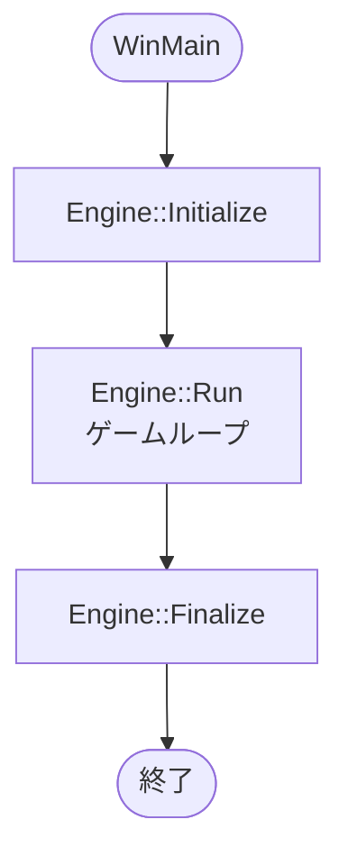
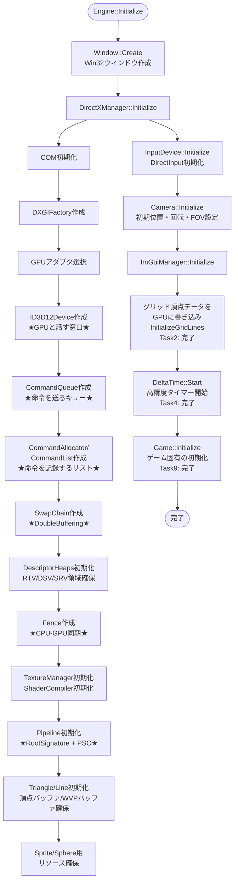
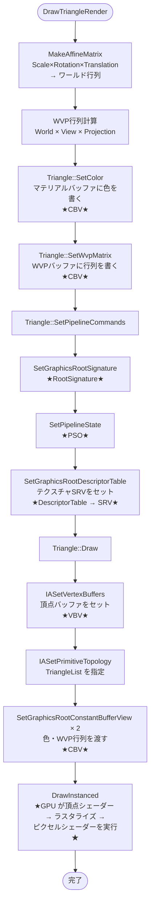
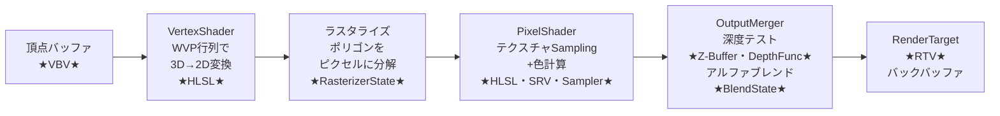
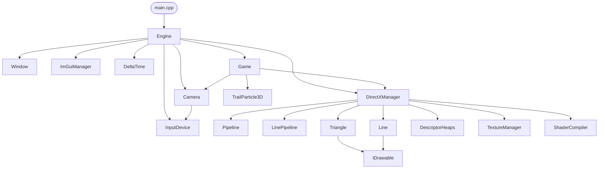

# DirectXGame プログラムフロー図

Mermaid 形式で書いています。VS Code の「Markdown Preview Mermaid Support」拡張機能か
Obsidian でプレビューすると図として表示されます。

---

## 全体フロー（起動〜終了）



---

## Initialize 詳細



---

## ゲームループ（Run）

```mermaid
flowchart TD
    A([Engine::Run]) --> LOOP{Window::ProcessMessage\nウィンドウが生きているか}
    LOOP -- 生きている --> B
    LOOP -- 閉じた --> END([ループ終了])

    B[InputDevice::Update\nキー・マウス状態を更新] --> C
    C[DeltaTime::Update\n前フレームからの経過秒を計算] --> D

    D[DirectXManager::BeginFrame] --> D1
    D1[CommandAllocator/List リセット\n前フレームの命令を消去] --> D2
    D2[バックバッファのRTVを取得\n今から描くバッファを決める] --> D3
    D3[OMSetRenderTargets\nRTV + DSV をセット] --> D4
    D4[ClearRenderTargetView\n画面を黒でクリア] --> D5
    D5[ClearDepthStencilView\nZ-Bufferをクリア] --> D6
    D6[SetDescriptorHeaps\nSRVヒープをセット] --> D7
    D7[RSSetViewports\nRSSetScissorRects\n描画範囲を設定<br/>Task3: 1回だけ設定] --> E

    E[ImGui::BeginFrame\nUI描画の準備] --> F

    F[Game::Update<br/>deltaTimeを渡す] --> F1
    F1[Transform回転更新\n60度/秒 × deltaTime] --> F2
    F2[Camera::HandleInput<br/>マウス・キーボードでカメラ移動] --> F3
    F3[TrailParticle3D::Update × 20<br/>パーティクル状態更新<br/>Task18: deltaTime対応]

    F3 --> G[Game::Render]
    G --> G1[ViewMatrix計算\nProjectionMatrix計算]
    G1 --> G2[DrawTriangleRender × 2\n三角形を描画]
    G2 --> G3[DrawLineRender × 1\nラインを描画]
    G3 --> G4[DrawGridBatch\nグリッドを1DrawCallで描画<br/>Task2: 202→1 DrawCall]
    G4 --> G5[Game::DrawImGui<br/>FPS/Camera/Trail UIを描画]
    G5 --> G6[パーティクル描画ループ\n最大 20×100=2000個]

    G6 --> H[ImGui::EndFrame\nUI描画命令を記録]
    H --> I

    I[DirectXManager::EndFrame] --> I1
    I1[EndTransitionBarrier\nバックバッファを Present 状態に] --> I2
    I2[CommandList::Close\n命令の記録を終了] --> I3
    I3[CommandQueue::ExecuteCommandLists\n命令をGPUに送る] --> I4
    I4[SwapChain::Present\nバッファを画面に表示\nVsync待機] --> I5
    I5[Fence Signal/Wait\nGPU完了を待つ] --> I6
    I6[CommandAllocator Reset\n次フレームの準備]

    I6 --> LOOP
```



---

## DrawTriangleRender の中身（1回の描画命令）

※ Task3: RSSetViewports/RSSetScissorRects は BeginFrame で設定済みのため呼ばない



---

## GPU 内部でやっていること（DrawInstanced の後）



---

## クラス間の依存関係（Task8・9: 完全分離）



---

## 各フレームのタイムライン（CPU と GPU の関係）

```
CPU側の処理                          GPU側の処理
───────────────────────────────────────────────────────
[InputDevice::Update]
[DeltaTime::Update]
[BeginFrame]
  CommandList にRTV/DSV/Viewport設定   
[Update]
  Transform計算
  Camera移動
  Particle更新
[Render]
  CommandList に DrawInstanced記録（命令をためるだけ）
[ImGui::EndFrame]
  CommandList に ImGui描画命令記録
[EndFrame]
  CommandList::Close
  ExecuteCommandLists ─────────────────→ GPUが命令を受け取って実行開始
  Present ─────────────────────────────→ VSync待機
  Fence Wait ──────────────────────────→ GPU描画完了を確認
[次フレームへ]
```

---

## 用語マッピング（コード上の名前 ↔ DirectX 用語）

| コード上の名前 | DirectX 用語 | 場所 |
|---|---|---|
| `commandList_` | CommandList | DirectXManager |
| `commandQueue_` | CommandQueue | DirectXManager |
| `swapChain_` | SwapChain / DoubleBuffering | DirectXManager |
| `fence_` | Fence（CPU-GPU同期） | DirectXManager |
| `vertexResource_` | Buffer / Resource | Triangle / Line |
| `vertexBufferView_` | VertexBufferView (VBV) | Triangle / Line |
| `wvpResource_` | Buffer（定数バッファ） | Triangle / Line |
| `materialResource_` | Buffer（定数バッファ） | Triangle / Line |
| `viewport_` | Viewport | DirectXManager |
| `scissorRect_` | Scissor | DirectXManager |
| `pipeline_` | PSO / RenderingPipeline | Engine/Graphics/Pipeline/ |
| `linePipeline_` | PSO / RenderingPipeline（Line用） | Engine/Graphics/Pipeline/ |
| `rootSignature_` | RootSignature | Pipeline |
| `descriptorRange_` | DescriptorRange | DirectXManager |
| `textureSrvHandle` | ShaderResourceView (SRV) | TextureManager |
| `rtvHandle` | RenderTargetView (RTV) | DescriptorHeaps |
| `dsvHandle` | DepthStencilView (DSV) | DescriptorHeaps |
| `wvpMatrix` | Transform（WVP行列） | Game / Triangle |
| `cameraData_` | Camera / View / Projection | Camera |
| `deltaTime_` | FrameTime（フレーム間経過秒） | Engine/Utils/DeltaTime |
| `.hlsl ファイル` | HLSL / VertexShader / PixelShader | Shaders/ |
| `gSampler` | Sampler | HLSLファイル内 |
| `texcoord` | TextureCoordinate (UV) | 頂点データ |
| `Z-Buffer` | ClearDepthStencilView で毎フレームクリア | DirectXManager |

---

## フォルダ構造（Task8: 完全集約）

```
DirectXGame/
├── Engine/
│   ├── Engine.h/.cpp          ← エンジン基盤（ゲームループ・初期化）
│   ├── Camera/                ← ビュー・プロジェクション行列
│   ├── Window/                ← Win32ウィンドウ
│   ├── InputDevice/           ← DirectInput（キーボード・マウス）
│   ├── Utils/                 ← DeltaTime, Logger, StringUtils
│   └── Graphics/
│       ├── DirectXManager.h/.cpp   ← DirectX全般（God Class）
│       ├── Pipeline/               ← PSO管理
│       ├── DescriptorHeaps/        ← RTV/DSV/SRV領域
│       ├── ShaderCompiler/         ← HLSLコンパイル
│       ├── Texture/                ← テクスチャ管理
│       └── Object/
│           ├── IDrawable.h         ← 描画基底クラス
│           ├── Triangle/           ← 三角形描画
│           └── Line/               ← ライン描画
├── Game/
│   ├── Game.h/.cpp            ← ゲーム固有ロジック（Task9: 分離）
├── Particle/
│   └── TrailParticle3D.h/.cpp ← パーティクルシステム
├── Math/                      ← MathTypes, MatrixMath, VectorMath
└── Externals/                 ← ImGui, DirectXTex
```
