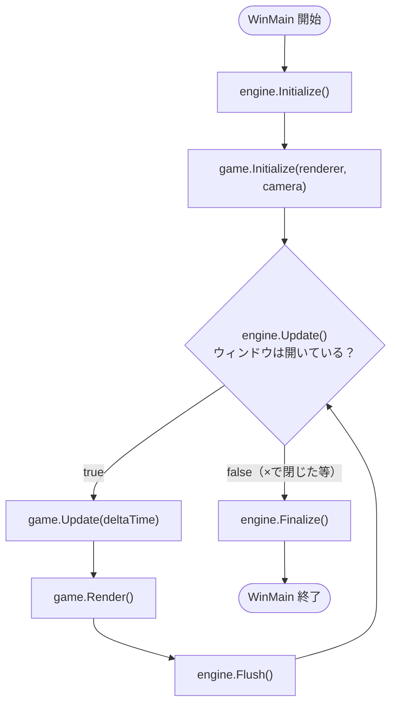
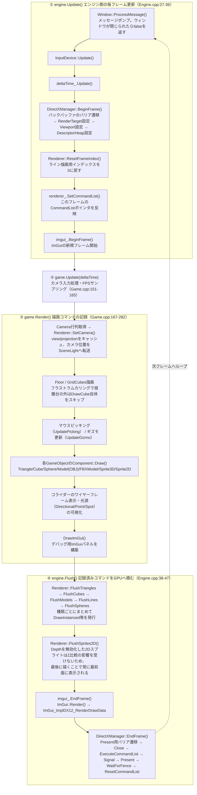
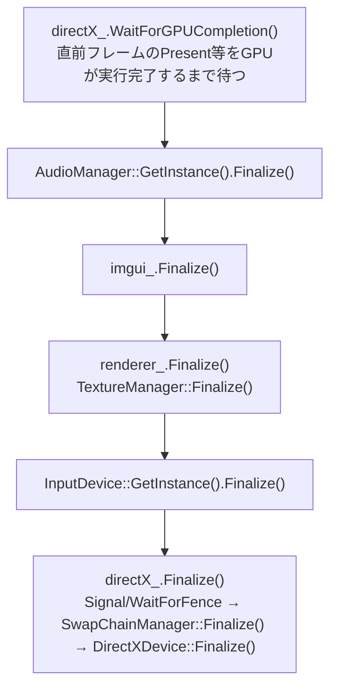
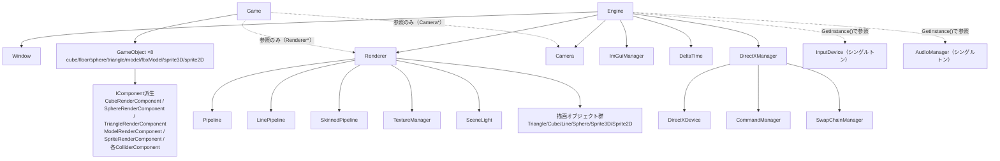
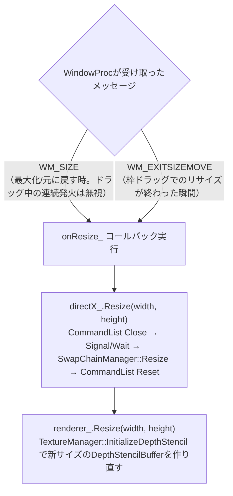

# プログラム全体の流れ図

ClearRoot Engine（自作DirectX12ゲームエンジン）の、起動から終了までの処理の流れをまとめたドキュメント。
「何を呼んでいるか」だけでなく「なぜその順番なのか」も可能な範囲で注記している。

> 作成基準日: 2026-07-03（このドキュメントはコードのスナップショットなので、実装が変わったら古くなる。疑わしい箇所は本文中に書いたファイル名・行番号を実際に読み直すこと）

## 目次
1. [全体像（ダイジェスト）](#1-全体像ダイジェスト)
2. [初期化フロー（Engine::Initialize）](#2-初期化フローengineinitialize)
3. [メインループ（Update / Render / Flush）](#3-メインループupdate--render--flush)
4. [終了処理（Engine::Finalize）](#4-終了処理enginefinalize)
5. [クラス構成・所有関係](#5-クラス構成所有関係)
6. [主要クラス一覧表](#6-主要クラス一覧表)
7. [Game::Render() 内の描画順序](#7-gamerender-内の描画順序)
8. [番外: ウィンドウリサイズ時の流れ](#8-番外-ウィンドウリサイズ時の流れ)
9. [命名パターンのまとめ](#9-命名パターンのまとめ)

---

## 1. 全体像（ダイジェスト）

エントリーポイントは `main.cpp:8` の `WinMain`。`Engine` と `Game` という2つのクラスを生成し、
「初期化 → ループ（更新・描画・GPU実行）→ 終了処理」という単純な形をしている。
`Engine` はウィンドウ・DirectX12・入力・音声などエンジン共通部分を、`Game` はその上でオブジェクトを配置して動かすゲーム側のロジックを担当する。

出典: `main.cpp:10-24`

---

## 2. 初期化フロー（Engine::Initialize）

`Engine::Initialize()`（`Engine/Engine.cpp:5-25`）が呼ぶ順番。DirectX12はDevice→CommandQueue→SwapChainの順でしか作れない（後者が前者に依存する）ため、この順序は厳密に守る必要がある。

```mermaid
flowchart TD
    A["Debug::RegisterCrashHandler()<br/>クラッシュ時にダンプを出力できるようにする"] --> B["Logger::Initialize()"]
    B --> C["Window::Create()<br/>Win32APIでOSウィンドウを生成"]
    C --> D["Debug::EnableDebugLayer()<br/>D3D12デバッグレイヤーを有効化（Device生成前に呼ぶ必要あり）"]
    D --> E1

    subgraph DXInit["directX_.Initialize()  ＝ DirectXManager::Initialize()"]
        E1["DirectXDevice::Initialize()<br/>COM初期化 → DXGIFactory → Adapter選択 → D3D12Device生成"] --> E2["CommandManager::Initialize()<br/>CommandQueue → CommandAllocator → CommandList → Fence"]
        E2 --> E3["SwapChainManager::Initialize()<br/>SwapChain(バックバッファ2枚) → RTV/DSV/SRV用DescriptorHeap → DepthStencilBuffer"]
    end

    E3 --> F1

    subgraph RInit["renderer_.Initialize()  ＝ Renderer::Initialize()"]
        F1["ShaderCompiler::InitializeDXC()"] --> F2["各Pipeline初期化<br/>Pipeline / Sprite2D用Pipeline / LinePipeline / SkinnedPipeline"]
        F2 --> F3["TextureManager初期化<br/>DepthStencilバッファ・デフォルトテクスチャ生成"]
        F3 --> F4["描画オブジェクト初期化<br/>Triangle / Cube / Line / Sprite3D / Sprite2D / Sphere"]
        F4 --> F5["SceneLight::Initialize()"]
    end

    F5 --> G["directX_.WaitForGPUCompletion()<br/>Renderer初期化中にCommandListへ積んだ<br/>テクスチャ等のアップロードコマンドをGPUに実行させ、完了を待つ"]
    G --> G2["renderer_.SetCommandList()<br/>WaitForGPUCompletion内でReset済みのCommandListを<br/>改めてRenderer側に渡す"]
    G2 --> H["InputDevice::GetInstance().Initialize()<br/>DirectInputでキーボード/マウスを初期化"]
    H --> I["Debug::SetupInfoQueue()<br/>D3D12のワーニング/エラーを検知できるようにする"]
    I --> J["camera_.Initialize()"]
    J --> K["imgui_.Initialize()<br/>ImGuiのWin32/D3D12バックエンド初期化"]
    K --> L["AudioManager::GetInstance().Initialize()<br/>XAudio2初期化"]
    L --> M["deltaTime_.Start()"]
```

出典: `Engine/Engine.cpp:5-25`, `Engine/Graphics/Renderer/DirectXManager.cpp:9-23`, `Engine/Graphics/Renderer/Renderer.cpp:13-61`

補足:
- `Initialize()` の最後（`Engine/Engine.cpp:21-24`）で `window_.SetResizeCallback(...)` を登録している。これは即実行される処理ではなく、後述の[8. ウィンドウリサイズ時の流れ](#8-番外-ウィンドウリサイズ時の流れ)で呼ばれるコールバックの登録。
- `game.Initialize(engine.GetRenderer(), engine.GetCamera())`（`main.cpp:14`）は上記の後、`WinMain` 側から呼ばれる。`Game` は `Renderer*` / `Camera*` を**所有せず借りるだけ**（詳細は[5章](#5-クラス構成所有関係)）。

---

## 3. メインループ（Update / Render / Flush）

`main.cpp:16-20` の `while` ループ1回転が1フレームに対応する。CPU側で描画コマンドを「記録」するフェーズと、それをGPUに「実行」させるフェーズが分かれているのがポイント（バッチ化して呼び出しコストを下げるため）。

出典: `Engine/Engine.cpp:27-47`, `Game/Game.cpp:151-282`, `Engine/Graphics/Renderer/DirectXManager.cpp:25-53`

補足（GPU同期の考え方）:
- `EndFrame()` は `Signal()`（フェンス値を+1して積む）の**直後**に `Present()` を呼び、その後 `WaitForFence()` でCPUがGPU完了を待つ。つまり **1フレームごとにCPU/GPUが同期し切ってから次のフレームへ進む**、シンプルだが並列度が低い実装になっている（`Engine/Graphics/CommandManager/CommandManager.cpp:52-67`）。

---

## 4. 終了処理（Engine::Finalize）

`main.cpp:22` の `engine.Finalize()` が呼ぶ順番（`Engine/Engine.cpp:49-60`）。

出典: `Engine/Engine.cpp:49-60`

なぜ最初に `WaitForGPUCompletion()` を呼ぶのか（コード上のコメントより）:
直前フレームの `Present` 等をGPUがまだ実行中の状態で ImGui や Renderer が（フォントテクスチャなどの）GPUリソースを解放してしまうと、GPUがまだ参照しているリソースを壊すことになり `STATE_CREATION` 警告が発生する。これを避けるため、他の終了処理より先にGPUの完了を待ち切る。

---

## 5. クラス構成・所有関係

実線矢印は「所有している（メンバ変数として持つ）」、点線矢印は「ポインタで参照して使っているだけ（所有していない）」を表す。

`Game` は `Engine` のメンバではなく、`main.cpp` 側で `Engine` と対等に生成され、`Initialize()` の引数経由で `Renderer*` / `Camera*` を受け取っている点に注意（`Engine` が `Game` を知ることはない）。

---

## 6. 主要クラス一覧表

| クラス | ファイル | 役割 |
|---|---|---|
| Engine | `Engine/Engine.h`, `.cpp` | 全サブシステムを所有し、Initialize/Update/Flush/Finalizeの4メソッドで統括する司令塔 |
| Window | `Engine/Window/Window.h`, `.cpp` | Win32APIでのウィンドウ生成・メッセージポンプ・リサイズイベント通知（コールバック） |
| DirectXManager | `Engine/Graphics/Renderer/DirectXManager.h`, `.cpp` | DirectXDevice/CommandManager/SwapChainManagerを統合し、BeginFrame/EndFrameで1フレーム分のGPU制御をまとめる |
| DirectXDevice | `Engine/Graphics/DirectXDevice/DirectXDevice.h`, `.cpp` | COM初期化、DXGIFactory・Adapter選択、D3D12デバイス生成 |
| CommandManager | `Engine/Graphics/CommandManager/CommandManager.h`, `.cpp` | CommandQueue/Allocator/List/Fenceを管理し、コマンド実行とCPU-GPU同期（Fence）を担当 |
| SwapChainManager | `Engine/Graphics/SwapChainManager/SwapChainManager.h`, `.cpp` | SwapChain、RTV/DSV/SRV用DescriptorHeap、DepthStencilBufferを管理 |
| Renderer | `Engine/Graphics/Renderer/Renderer.h`, `.cpp` | Draw*呼び出しをコマンドとして蓄積し、Flush*でまとめてGPUに積む。パイプラインと描画オブジェクト群を所有 |
| Pipeline / LinePipeline / SkinnedPipeline | `Engine/Graphics/Pipeline/*.h`, `.cpp` | 用途別のPSO（PipelineStateObject）とRootSignatureを構築 |
| GameObject | `Engine/GameObject/GameObject.h` | Transformを直接所有し、IComponent派生を任意の数だけアタッチできる軽量コンテナ |
| Camera | `Engine/Camera/Camera.h`, `.cpp` | 入力によるカメラ移動処理、View/Projection行列の計算 |
| InputDevice | `Engine/InputDevice/InputDevice.h`, `.cpp` | シングルトン。DirectInputでキーボード/マウス状態を毎フレーム更新 |
| AudioManager | `Engine/Audio/AudioManager.h`, `.cpp` | シングルトン。XAudio2初期化、BGM/SE用SubmixVoice管理 |
| SceneLight | `Engine/Graphics/Lighting/SceneLight.h`, `.cpp` | Directional/Point/Spotライトのパラメータ保持とGPU定数バッファへの転送 |
| ImGuiManager | `Externals/imgui/imguiManager.h`, `.cpp` | ImGuiのWin32/D3D12バックエンド統合、BeginFrame/EndFrame制御 |
| Game | `Game/Game.h`, `.cpp` | GameObject群の生成・配置、毎フレームのUpdate/Render、ImGuiデバッグパネル |

---

## 7. Game::Render() 内の描画順序

`Game.cpp:167-282` の実際の呼び出し順（`Game::Render()` は毎フレーム呼ばれ、描画コマンドを記録するだけでGPU実行は行わない）。

1. Floor（Cube共用コンポーネント）
2. GridCubes（最大 48³ = 110,592個。フラストラムカリングで視錐台外を除外してからDrawCube）
3. マウスピッキング（`UpdatePicking`） / ギズモ操作（`UpdateGizmo`、ImGuizmo使用）
4. Triangle → Cube → Sphere → Model(OBJ) → FBXModel → Sprite3D → Sprite2D（各GameObjectの `Component::Draw()`）
5. コライダー（Sphere/OBB）のワイヤーフレーム可視化（重なっていれば赤、していなければ緑）
6. 光源の可視化: 平行光源（球＋原点へのライン）／ポイントライト（球）／スポットライト（球＋照射方向のライン）
7. `DrawImGui()` によるデバッグパネル構築

---

## 8. 番外: ウィンドウリサイズ時の流れ

メインループとは別に、Win32のウィンドウメッセージが引き金になる非同期の流れ。`engine.Update()` 内の `Window::ProcessMessage()`（実体は `GetMessage`/`DispatchMessage` 経由で `Window::WindowProc` を呼ぶ）から派生する。

出典: `Engine/Window/Window.cpp:69-105`, `Engine/Engine.cpp:21-24`, `Engine/Graphics/Renderer/DirectXManager.cpp:55-73`

`onResize_` は `Engine::Initialize()` の末尾（`Engine/Engine.cpp:21-24`）でラムダとして登録されたコールバックで、`Window` が直接 `DirectXManager`/`Renderer` を知らなくても済むようにする橋渡し役になっている。

---

## 9. 命名パターンのまとめ

このコードベース全体で緩く守られている命名規則:

- **Initialize**: 起動時に1回だけ呼ぶ、リソース確保・生成
- **Update**: 毎フレーム、CPU側の状態（入力・時間・Transform等）を更新
- **Render / Draw**: 毎フレーム、GPUに送るコマンドを「記録」する（この時点ではまだGPUは実行しない）
- **Flush**: 記録済みのコマンドをまとめてGPUに「実行」させる
- **Finalize**: 終了時に1回だけ呼ぶ、リソース解放

CPU側のコマンド記録（Render/Draw）とGPU側の実行（Flush）を分離しているのは、同種の描画（同じCubeを1万個描く、等）をバッチにまとめてから一度にGPUへ積むことで、1回ずつ即座に発行するより効率を上げるため。
